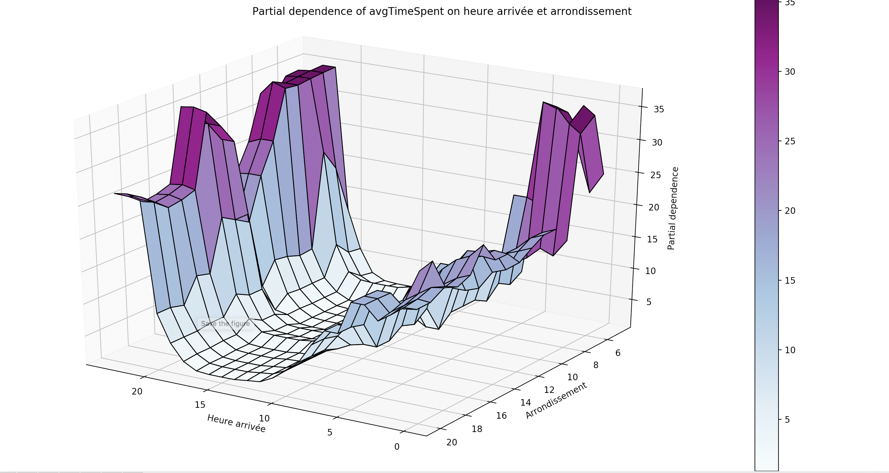
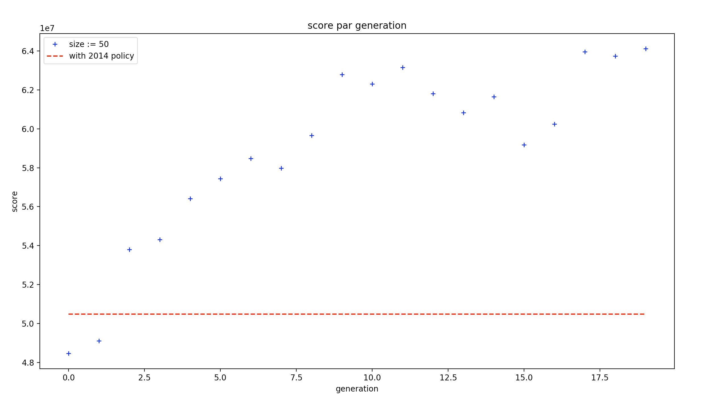

# Oliver Wyman Data Case Challenge 2018 - Paris Parking Pricing

## The case :

```html
The OW data case challenge is a competition consisting in solving a business case study
by applying analytical skills to a set of real data;
(in this case data from the city of Paris).
```

We therefore looked at the question of the pricing of parking spaces in the city of Paris.

## The team :

Our team was composed of :

- [Paul Garnier](https://www.linkedin.com/in/paul-garnier-6b7481149/) ([Mines de Paris, PSL University](https://www.minesparis.psl.eu/))
- [Marc-Adrien Gergaud](https://www.linkedin.com/in/marc-adrien-gergaud-140a21108/) ([ESCP Europe](https://escp.eu/) - [Mines de Paris, PSL University](https://www.minesparis.psl.eu/))
- [Théophane Gregoir](https://www.linkedin.com/in/theophane-gregoir/) ([Mines de Paris, PSL University](https://www.minesparis.psl.eu/) - [MIT](https://www.mit.edu/))
- [Arthur Verrez](https://www.linkedin.com/in/arthur-verrez/) ([Mines de Paris, PSL University](https://www.minesparis.psl.eu/))

## Overview : 

### Data : 

- A few graph on the [Paris Open Data : arrondissements](https://opendata.paris.fr/explore/dataset/arrondissements/table/), in the form of a GeoJson. This file is used with [folium](https://github.com/python-visualization/folium) to create maps.
- For example, the dependancy between the time spent by users, depending on the districts and the arrival time :



- The .npy files are not available in this repo.

### Map : 

- A few scripts in .py to create folium maps. They are however only compatible with our .npy files.
- A few examples of folium maps in .html. To use/display them, copy the source code and save it in an html file.
- For example, with [map arrondissement](https://github.com/ArthurVerrez/oliver-wyman-datacase-2018/blob/master/Map/arrondissement-map-test.html), you will be able to display a map presenting different characteristics by district (time spent, attendance, average cost, rate of rotating users and rate of blue card), as well as underground car parks in Paris (in blue).


### python-src : 

- {Data,Map,Graph}Maker: the .py files used to create the majority of our maps, graphs, and tables used in our calculations.
- AI: Algorithms allowing the simulations of our environments (GA,NN,RP) and revenue calculations.
- Example of the result of the GA (20 generations only, for the example) :



